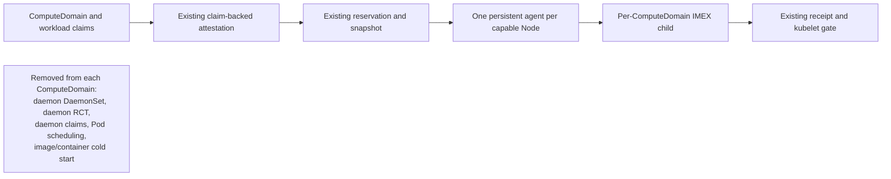

| Field          | Value |
|----------------|-------|
| Status         | experimental implementation; hardware and scale validation pending |
| Authors        | @dims |
| Created        | 2026-08-16 |
| Related issues | [#920](https://github.com/kubernetes-sigs/dra-driver-nvidia-gpu/issues/920), [#1107](https://github.com/kubernetes-sigs/dra-driver-nvidia-gpu/issues/1107), [#1152](https://github.com/kubernetes-sigs/dra-driver-nvidia-gpu/issues/1152) |

## Executive decision

Implement `persistent-agent-v1` as one narrow change to the verified
`controller-v1` design: replace the per-ComputeDomain daemon DaemonSet and its
per-Pod ResourceClaims with one installation-scoped persistent-agent DaemonSet.

Everything else stays on the existing controller-owned path:

- claim-backed Node attestation;
- whole-clique isolation;
- deterministic index allocation;
- `ComputeDomainCliqueReservation` ownership;
- `ComputeDomainCliqueSnapshot` desired state and receipts;
- kubelet release checks;
- quarantine and evidence-bearing retirement; and
- legacy and `controller-v1` compatibility.

Do not add a topology CRD, Runtime CRD, acknowledgment CRD, placement API,
local usage-lease protocol, scheduler plugin, or second controller state
machine. Do not require an unreleased Kubernetes version. If the persistent
agent does not materially improve measured convergence, stop rather than adding
more architecture.

Today a ComputeDomain causes Kubernetes to create another DaemonSet, another
set of Pods, and another set of DRA claims. Those daemon Pods must be observed,
scheduled, prepared, started, and made Ready before the workload can run. At
large scale this second scheduling wave is more expensive than choosing clique
indices.

The persistent-agent protocol keeps one helper Pod ready on every capable Node.
It is still a normal Kubernetes DaemonSet, but it is created when the feature is
installed, not once per ComputeDomain. When a `persistent-agent-v1` snapshot
becomes Active, the existing helper starts the same `nvidia-imex` child that a
per-domain daemon Pod would have started. When the ComputeDomain retires, the
helper stops and reaps that child, writes the existing retirement evidence, and
becomes idle again.

Compared with `controller-v1`, this removes the per-ComputeDomain daemon
DaemonSet, daemon ResourceClaimTemplate, daemon ResourceClaims, daemon Pod
scheduling, repeated image startup, and deletion of those objects. It does not
remove ordinary workload scheduling, workload ResourceClaims, claim-backed
membership attestation, Node routing writes, snapshots, reservations, local
receipts, or strict retirement. Those remaining costs must still be measured.



## Summary

Add the Persistent ComputeDomain Agent architecture under a new Alpha feature
gate, with `persistent-agent-v1` as its immutable protocol identifier. It uses
the `controller-v1` reservation, snapshot, allocation, attestation, receipt, and
retirement contracts without copying them. A single installation-scoped
persistent-agent DaemonSet consumes `persistent-agent-v1` snapshots and
supervises at most one IMEX child per Node. The existing physical-clique
reservation guarantees that a persistent agent cannot be assigned two active
ComputeDomains on the same clique.

The first implementation is intentionally post-scheduling. Workload Pods and
their generated claims remain the source of membership attestation, exactly as
in controller-v1. Preplanning whole cliques before workload submission may be
studied later, but it is not required to remove the measured second daemon
scheduling wave and would add a new placement API and topology authority.

## Motivation

### Evidence

The project has already tried several allocator changes:

- conflict backoff and jitter improved but did not remove the original
  many-writer behavior;
- server-side apply moved dependent-index conflicts into the API server and
  performed worse at scale;
- per-clique sharding bounded contention and was the major allocator win; and
- the centralized prototype in issue #1107 removed allocator 429 responses but
  did not materially improve end-to-end latency after equivalent tuning.

At 5,040 Nodes, the remaining delay was dominated by daemon DaemonSet/Pod and
ResourceClaim scheduling, image/container startup, IMEX startup, and the
ordinary workload-claim scheduler path. Controller-v1 solves determinism and
safe reuse, but intentionally retains the dynamic daemon lifecycle.

The persistent-agent protocol addresses only the part the driver can remove
portably: the second, per-ComputeDomain daemon scheduling wave. Kubernetes
scheduler improvements may reduce the workload-claim portion in future
releases, but this protocol must work and be measured on the driver's released
supported versions.

### Goals

- Remove all per-ComputeDomain daemon Pods and daemon claims from `T0` to `T3`.
- Reuse controller-v1's verified safety state machine instead of redesigning it.
- Keep one independently schedulable and independently upgradable agent Pod on
  each capable Node.
- Preserve exact local receipt gating and positive retirement evidence.
- Keep legacy and `controller-v1` behavior unchanged when the protocol is
  disabled.
- Avoid new cluster-wide informers or unbounded work queues.
- Produce attributed measurements for 18, 144, and 280x18 Nodes.
- Support the DRA API version selected by the existing compatibility layer on
  every Kubernetes minor included in the persistent-agent test matrix.

### Non-goals

- Preselecting cliques before workload scheduling.
- Removing the workload ResourceClaim or scheduler path.
- Running concurrent ComputeDomains on one physical clique.
- Sharing one permanently running IMEX domain across tenants.
- Replacing controller-v1 or legacy-v1 in place.
- Changing the deterministic assignment algorithm.
- Redesigning retirement, recovery, or index reuse.
- Depending on Kubernetes v1.37 or another unreleased version.
- Making host-managed IMEX and `persistent-agent-v1` the same mode.

## Why this belongs in the NVIDIA DRA driver

The cost being removed is created by the driver's own per-ComputeDomain daemon
objects. The persistent agent also needs NVIDIA-specific management-device
access, IMEX configuration, peer-map installation, READY probing, and
retirement evidence. Kubernetes DRA and the scheduler should continue to handle
ordinary workload claims; they should not own this NVIDIA-specific child
process.

## Simplification contract

The implementation must follow these constraints unless this proposal is
amended first:

1. Add no new CRD kind.
2. Add no second controller manager, queue, allocator, or retirement engine.
3. Add no controller watch of a resource controller-v1 does not already watch.
4. Add no per-ComputeDomain daemon workload object for `persistent-agent-v1`.
5. Keep the current snapshot name, canonical hash, assignments, members,
   receipt, and retirement evidence formats wherever possible.
6. Represent the persistent-agent mode with additive protocol/config fields,
   not copied APIs.
7. Localize protocol branching to protocol selection, daemon-provider lookup,
   persistent-agent execution, status observation, and cleanup.
8. Prefer deleting a controller-v1-only assumption over adding a parallel
   implementation.
9. Generated client/CRD changes do not justify speculative fields.
10. Record `git diff --stat` for every implementation phase. A phase which
    grows a parallel state machine must stop for design review.

The expected production-code shape is one small daemon-provider abstraction:

```go
type daemonProvider interface {
    MembersForClique(ctx context.Context, cd *ComputeDomain, cliqueID string) ([]*Pod, error)
    DeletePerDomainArtifacts(ctx context.Context, cd *ComputeDomain) error
}
```

`controller-v1` selects the existing per-domain DaemonSet provider.
`persistent-agent-v1` selects `persistentAgentProvider`. Reservation, allocation,
snapshot publication, kubelet validation, and retirement continue below that
boundary in shared code. The exact Go interface may differ if a smaller branch
is clearer; the architectural constraint is the single shared state machine.

## Design

### Persistent-agent protocol

Add `persistent-agent-v1` to `ComputeDomainCliqueProtocol`. As with `controller-v1`:

- the creator requests it explicitly;
- the elected controller persists it before creating artifacts;
- it is immutable for the life of the ComputeDomain;
- disabling the feature gate stops new selection but not reconciliation of
  persisted persistent-agent objects; and
- old binaries reject the unknown protocol instead of treating it as legacy.

Use one Alpha gate, `PersistentComputeDomainAgents`, and the existing
canary namespace allowlist. Gate-off installations create no persistent-agent
objects and start no persistent-agent-only readers.

The user-facing request remains one annotation; the protocol adds no placement
fields:

```yaml
apiVersion: resource.nvidia.com/v1beta1
kind: ComputeDomain
metadata:
  name: training-domain
  namespace: approved-canary
  annotations:
    resource.nvidia.com/requestedComputeDomainCliqueProtocol: persistent-agent-v1
spec:
  numNodes: 18
  channel:
    resourceClaimTemplate:
      name: training-domain-channel
```

The chart gate and canary allowlist must be enabled before the controller will
persist `persistent-agent-v1`; an annotation alone never authorizes it.

### Reused API objects

The persistent-agent protocol uses the existing three CRDs:

| Object | Persistent-agent use |
|--------|-------------------|
| `ComputeDomainCliqueReservation` | Same API-server-atomic physical-clique ownership and release record |
| `ComputeDomainCliqueSnapshot` | Same deterministic assignments, exact persistent-agent Pod identities, desired peer map, phase, generation, and hash |
| `ComputeDomainCliqueRetirementEvidence` | Same `ProcessExit` or `NodeReboot` proof before reuse |

Make one additive change to snapshot spec: an optional immutable `protocol`
field. Empty means the historical controller-v1 value for old objects; new
objects always write an explicit protocol. Consumers reject a protocol they do
not implement. Reservation activation already binds the exact snapshot UID,
generation, and hash, so no second Runtime reference is needed.

Do not add a topology inventory API. The persistent-agent protocol retains the
`controller-v1` requirement that `spec.numNodes`, claim-backed attestation,
current clique labels, immutable startup identity, and the whole-clique
isolation label all agree before first publication. Missing or ambiguous Nodes
keep the snapshot Pending.

### Persistent-agent fleet

Render one DaemonSet and one ResourceClaimTemplate when the persistent-agent
gate is enabled.
The DaemonSet:

- schedules on the same IMEX-capable Nodes as the compute-domain kubelet plugin;
- uses `OnDelete` update strategy;
- uses the existing compute-domain-daemon image;
- runs `compute-domain-daemon run --persistent-agent`;
- receives one installation-scoped claim per Pod for the existing IMEX
  management device and a shared driver-owned state root;
- uses the existing read-only daemon ServiceAccount plus narrowly scoped
  permission to patch only its own applied-state annotation and create its own
  retirement evidence;
- is Ready while idle when its supervisor is healthy, and while assigned only
  when the exact child is READY; and
- never allocates indices or mutates shared membership.

The bootstrap claim reuses `ComputeDomainDaemonConfig` with one additive
`mode: PersistentAgent` value. The default remains `PerDomain`. In
persistent-agent mode the kubelet plugin validates the installation namespace
and protocol, mounts the existing ComputeDomain state root rather than one
domain directory, and injects the same IMEX management device. It does not look
up a synthetic ComputeDomain.

Phase 0 must prove this generic claim works on each supported DRA API version.
If it cannot, the implementation stops. It must not work around the result with
privileged host namespace entry, static Pods, or a second device-access path.

### Snapshot formation

Formation retains the existing sequence:

1. Workload Pods schedule and their generated claims allocate.
2. The controller validates the Pod -> claim -> template -> ComputeDomain chain.
3. The controller writes the existing Node route and attestation.
4. Whole-clique isolation and the exact `spec.numNodes` barrier become true.
5. The controller creates or validates the physical reservation.
6. The shared allocator assigns stable indices from sorted Node UIDs.
7. The selected daemon provider supplies one exact Pod per selected Node.
8. The controller publishes the snapshot and activates the reservation.

For `persistent-agent-v1`, step 7 chooses the persistent-agent Pod on each Node.
No per-ComputeDomain DaemonSet or daemon ResourceClaimTemplate is created. The
snapshot member's existing `PodName`, `PodUID`, `PodIP`, Node UID, boot ID, and
index fields describe that persistent-agent incarnation without a schema
change.

The persistent-agent snapshot has no shared DaemonSet owner reference. It is
retained by its existing fence finalizer and validated against the ComputeDomain
UID, reservation, protocol, canonical name, and the fixed installation-scoped
persistent-agent DaemonSet. Deleting that DaemonSet must not cause garbage
collection of active snapshots.

### Persistent-agent apply loop

Refactor the existing controller-snapshot apply loop; do not create a second
validator or peer-file implementation.

At startup the agent discovers its Node name, Node UID, boot ID, clique ID, Pod
UID, and Pod IP. It watches snapshots in the primary driver namespace filtered
by its clique and `protocol=persistent-agent-v1`.

The agent permits zero or one nonterminal snapshot:

- zero: stay idle and keep no IMEX child running;
- one Pending snapshot: start nothing;
- one Active snapshot: validate the exact reservation binding, install the peer
  map, start or recover the IMEX child, wait for READY, and write the existing
  node-local receipt;
- one Retiring snapshot: stop and reap the child, then create the existing
  immutable retirement evidence;
- one Fenced snapshot: ensure the child is absent and remove only disposable
  local state after the controller releases the reservation; and
- more than one nonterminal snapshot: start nothing new, preserve any already
  running authorized child, report a conflict, and fail closed.

The process supervisor continues to use the existing `ProcessManager`, config
renderer, peer-file writer, READY probe, receipt writer, and retirement writer.
The difference is that their scope is selected when a snapshot is admitted
instead of being fixed by Pod environment at creation.

The agent must fsync the same receipt before reporting applied state. It then
uses a narrow JSON Patch, with Pod UID and existing-value tests, to change one
annotation on its own Pod containing the exact snapshot UID, generation, and
hash. That annotation is for controller status and debugging; the kubelet
continues to trust only the node-local receipt plus the exact live snapshot and
reservation. Clearing or spoofing the annotation never authorizes a workload.

### Workload release and ComputeDomain status

The `persistent-agent-v1` kubelet path is the existing `controller-v1` path with
the protocol enum extended. It requires:

- exact ComputeDomain and protocol;
- current topology validity;
- Active snapshot and matching Active reservation;
- canonical hash and unique member identities;
- the exact local Node and persistent-agent Pod member;
- persistent-agent Pod Ready;
- matching node-local receipt; and
- IMEX READY as represented by that receipt path.

No new local socket or lease database is introduced.

The controller sets aggregate ComputeDomain Ready only when every expected
snapshot is Active and every exact persistent-agent Pod is Ready and reports the
matching applied annotation. It writes NotReady when any fact is absent.
Repeated identical events are semantic no-ops. The applied annotation is never
part of the workload authorization decision. The agent clears it when the
assigned child is no longer the applied READY child.

### Retirement and reuse

Reuse the current controller-v1 retirement implementation:

1. ComputeDomain deletion stops new workload use through the existing teardown
   guard and workload inventory check.
2. Active snapshots move to Retiring without changing their member set, hash,
   or generation.
3. Each original persistent agent stops and reaps its IMEX child and creates
   `ProcessExit` evidence.
4. If the original agent is unavailable after a real Node reboot, the existing
   `NodeReboot` evidence rules apply.
5. Same-boot Pod replacement, Pod absence, elapsed time, and object deletion
   remain insufficient evidence.
6. After all exact members are fenced, the snapshot becomes Fenced, the
   reservation becomes Released, routing metadata is cleared, and the
   reservation may be deleted with the existing UID guards.
7. The persistent-agent Pod remains and can serve the next ComputeDomain.

The controller skips per-domain daemon DaemonSet and daemon template deletion
for `persistent-agent-v1`. It never deletes or rolls the installation-scoped
persistent-agent fleet as part of ComputeDomain cleanup.

### Agent upgrades

`OnDelete` is mandatory. A chart upgrade may update the DaemonSet template but
must not replace a persistent-agent Pod serving an Active or Retiring snapshot.

- Idle agents may be replaced in bounded batches.
- Active agents report `AgentUpgradePending` and stay in place.
- An operator drains the workload and completes normal retirement before
  deleting that agent Pod.
- Unexpected same-boot replacement while active retains the existing strict
  quarantine behavior.

The Alpha does not implement automatic persistent-agent fleet decommission
after the protocol has ever been used. Gate disable stops new persistent-agent
selection but leaves the fleet and reconciliation available until an explicit,
future empty-state decommission protocol exists.

### Informers and queues

The controller reuses the `controller-v1` informers and snapshot queue. The
`persistentAgentProvider` adds only an index over the existing driver-namespace
Pod informer by Node name. If the current server-side selector cannot include
both per-domain and persistent-agent Pods, widen that one namespace-scoped
informer and filter its handlers; do not add a second Pod watch. No new
cluster-wide Pod, Node, ResourceClaim, or template informer is allowed.

The persistent agent has one namespace-scoped, clique-filtered snapshot watch
and exact-name reservation reads. It must not watch all cluster reservations or
all ComputeDomains.

### Security and admission

Extend the existing single-install admission boundary rather than adding a
parallel policy family:

- only the controller may request/persist `persistent-agent-v1` and write its
  snapshots;
- only the fixed persistent-agent ServiceAccount may read its clique snapshots;
- the persistent agent may patch only its own applied annotation;
- Pod-bound identity must match the persistent-agent Pod UID and Node name;
- retirement evidence remains create-only and immutable;
- the persistent-agent DaemonSet, template, ServiceAccount, and bindings use
  the immutable installation identity; and
- a second installation cannot acquire the protected identities.

The primary control namespace remains trusted and admin-only for this Alpha.

### Kubernetes-version boundary

The driver continues to support the Kubernetes versions declared by the chart.
The persistent-agent implementation must use the existing version-converting
DRA client and the chart-selected ResourceClaimTemplate API version. New code
may not import a single resource API version as an architectural shortcut.

Run legacy regression tests on every supported minor. Run the persistent-agent
protocol on every supported minor where the Phase 0 bootstrap-claim spike
passes and document any narrower Alpha floor explicitly. Kubernetes v1.37 is
not a prerequisite; after it is released and supported, add it as another
comparative row.

## Expected request shape

For each ComputeDomain, `persistent-agent-v1` removes:

- one daemon ResourceClaimTemplate Create and later Delete;
- one per-domain DaemonSet Create/Update/Delete;
- one daemon Pod Create/Delete per selected Node;
- one daemon ResourceClaim Create/Delete per selected Node; and
- the scheduler and kubelet work caused by those daemon Pods and claims.

It retains `controller-v1`'s bounded formation writes:

- one Node route/attestation update per selected Node;
- one reservation Create per clique;
- one snapshot Create, finalizer update, Active status update, and reservation
  activation update per clique; and
- one persistent-agent applied-annotation patch per selected Node.

The applied annotation is an additional explicit write. The protocol's value
comes from deleting the substantially larger daemon object/scheduling wave, not
from claiming that all controller writes disappeared.

## Implementation plan

The code is split into reviewable signed commits, but the exit criteria below
remain promotion gates rather than claims implied by code completion.

Implementation status on 2026-08-16:

- Phases 0 and 1 are implemented. Feature-off and feature-on Helm renders pass
  for `resource.k8s.io/v1beta1`, `v1beta2`, and `v1`; live DRA preparation on
  every supported minor still needs QA.
- Phase 2 is implemented by selecting one of two daemon providers inside the
  existing controller state machine. Focused fake-API, race, and no-per-domain
  workload-object tests pass; the complete lost-response/429/failover matrix
  remains a QA gate.
- Phase 3 is implemented with one reusable child supervisor, per-domain local
  directories, durable receipts, applied-state publication, and the existing
  retirement evidence. An unexpected child exit restarts the agent container
  so startup invalidates its receipt before the snapshot can be applied again.
- Phase 4 accepts the new protocol through the existing reservation, snapshot,
  Pod identity, and local receipt checks. More specific kubelet Events remain
  follow-up observability work.
- Phase 5 has not started. No convergence improvement is claimed until the
  comparative measurements and genuine-fabric matrix pass.

### Phase 0 — prove the one new primitive

Build a small spike, without accepting `persistent-agent-v1` ComputeDomains, which proves:

1. one installation-scoped ResourceClaimTemplate can prepare one persistent-agent Pod per
   capable Node;
2. the existing kubelet plugin can inject the IMEX management device and shared
   state root without a real ComputeDomain UID;
3. an idle persistent-agent Pod can start, READY-check, stop, and reap one test IMEX child;
4. a second child cannot start concurrently; and
5. the same manifests work through each supported DRA API version.

Exit criteria:

- no privileged or host-namespace workaround;
- no per-ComputeDomain object in the spike;
- clean restart while idle;
- no regression with the gate disabled; and
- measured install-time API and scheduler cost recorded separately.

If this phase fails, stop. Do not add a new CRD or scheduler component to rescue
the design.

### Phase 1 — additive API and chart plumbing

- Add the protocol enum and snapshot protocol field.
- Add `PersistentAgent` mode to the existing daemon opaque config.
- Add the feature gate and explicit request validation.
- Render the persistent-agent ResourceClaimTemplate and OnDelete DaemonSet when
  the gate is enabled, and retain those objects across gate disable while
  persisted state may still need them.
- Extend existing RBAC/VAP identities and preflight.
- Generate clients/CRDs and inspect generated diff for unrelated churn.

Exit criteria:

- feature-off rendered object names and permissions match the existing release;
- old snapshot round trips and defaults to `controller-v1`;
- old binaries reject `persistent-agent-v1`;
- a second installation remains denied; and
- Helm install/upgrade/gate-disable paths pass on the supported matrix.

### Phase 2 — share the controller state machine

- Introduce the daemon-provider boundary at the smallest existing call site.
- Keep the per-domain provider unchanged for `controller-v1`.
- Add the indexed `persistentAgentProvider` for `persistent-agent-v1`.
- Skip daemon template and DaemonSet creation/deletion only for `persistent-agent-v1`.
- Publish persistent-agent snapshots through the existing allocator and write barrier.
- Validate existing snapshots and reservations before adoption.
- Drive Ready/NotReady from exact applied annotations with no-op suppression.
- Parameterize the existing action/write metrics by effective protocol rather
  than copying metric helpers for the new protocol.

Exit criteria:

- the fake-API harness proves `persistent-agent-v1` creates zero per-domain
  daemon workload objects;
- `controller-v1` action/write counts are unchanged;
- `persistent-agent-v1` uses the same reservation and snapshot transition tests; and
- restart, leader handoff, stale cache, lost response, 409, and 429 tests pass.

### Phase 3 — make the daemon reusable

- Split fixed Pod configuration from per-snapshot runtime configuration.
- Reuse the existing snapshot validator and apply loop.
- Add the clique-filtered selector and zero-or-one conflict rule.
- Write existing receipts under the selected ComputeDomain directory.
- Patch applied state only after receipt durability and READY.
- Reuse retirement evidence creation and child reaping.
- Clear the receipt and applied annotation after local retirement evidence is
  durable; retain the old domain directory until `Fenced` or exact released
  reservation evidence authorizes reuse.

Exit criteria:

- unit tests cover idle -> Active -> Retiring -> idle twice;
- unexpected child exit forces an agent-container restart, invalidates the
  receipt, and reapplies the same snapshot safely;
- same-boot Pod replacement remains blocked;
- real reboot evidence succeeds;
- two visible active snapshots start no second child; and
- peer-file and receipt failure injection remains fail closed.

### Phase 4 — extend the kubelet consumer

- Accept `persistent-agent-v1` in the existing snapshot/receipt validator.
- Resolve the exact persistent-agent member rather than a per-domain daemon member.
- Keep all structural, reservation, Pod UID, Node UID, boot ID, hash, receipt,
  and READY checks.
- Add Events which distinguish missing agent, unapplied snapshot, invalid
  receipt, and quarantined retirement.

Exit criteria:

- no persistent-agent-specific readiness bypass;
- no additional cluster-wide kubelet informer;
- Prepare/Unprepare restart tests pass; and
- legacy and `controller-v1` behavior is byte-for-byte unchanged where practical.

### Phase 5 — compare before expanding

Run identical `controller-v1` and `persistent-agent-v1` workloads with the same images,
pull policy, topology, API limits, scheduler settings, and arrival trace.

Required shapes:

- 18 Nodes / one clique;
- 144 Nodes / eight cliques;
- 280x18 / 5,040 Nodes; and
- at least one genuine-fabric GB200 or equivalent clique.

Required modes:

- tuned legacy-v1;
- `controller-v1`;
- `persistent-agent-v1` with an already-pulled image;
- `persistent-agent-v1` after an idle-agent restart; and
- host-managed IMEX as a separately labeled reference where supported.

Promotion requires:

- zero per-domain daemon Pods and claims in `persistent-agent-v1`;
- no correctness or retirement regression;
- no new unbounded watch or queue;
- no more than 5% p95 regression at 18 Nodes;
- at least 20% p95 improvement over `controller-v1` at the largest available
  scale, with raw samples and confidence intervals; and
- an attributed explanation if the remaining tail is the workload-claim
  scheduler path.

If the persistent-agent protocol does not meet the scale threshold, keep
`controller-v1` and remove the new implementation. Do not compensate by adding
speculative APIs.

## Test plan

### Unit and property tests

- Protocol selection, immutability, defaulting, and old-binary rejection.
- Persistent-agent config validation and installation-namespace binding.
- Exactly one persistent-agent Pod per selected Node; duplicate and stale Pod rejection.
- Deterministic allocation permutation properties unchanged from v1.
- Snapshot protocol included in validation and canonical adoption.
- Applied annotation is written only after durable receipt and READY.
- Ready -> NotReady -> Ready and unrelated-reconcile stability.
- Zero/one/multiple snapshot behavior in the persistent agent.
- Two sequential ComputeDomains reuse the same agent Pod safely.
- Active -> Retiring -> Fenced -> Released with ProcessExit evidence.
- NodeReboot recovery and same-boot replacement quarantine.
- Gate disable with persisted persistent-agent state.

### Fake-API state-machine harness

The harness must drive real informers and workqueues, not only pure helpers. It
records every API action and confirmed mutation.

Required scenarios:

- formation with caches initially behind;
- reservation Create committed but response lost;
- snapshot status conflict and retry;
- 429 and timeout retry without duplicate writes;
- controller restart before and after Active;
- leader handoff with old workers joined;
- persistent-agent Pod disappearance before Active;
- persistent-agent Pod disappearance after Active;
- two ComputeDomains contending for one clique;
- legacy-v1/`controller-v1`/`persistent-agent-v1` cross-protocol exclusion;
- workload deletion and ComputeDomain deletion ordering; and
- exact clique reuse after verified fence.

For `persistent-agent-v1`, the harness asserts no action creates a per-domain daemon
DaemonSet, daemon ResourceClaimTemplate, daemon Pod, or daemon ResourceClaim.

### Helm, admission, and Kind

- Default feature-off render and legacy upgrade.
- Admission-first enablement and ordinary Helm adoption.
- Second release and control-namespace migration denial.
- Persistent-agent ServiceAccount cannot mutate Nodes, snapshots, or reservations.
- Persistent-agent Pod can patch only its own applied annotation.
- Evidence creation is Pod/Node bound and immutable.
- OnDelete rollout leaves active agent Pods untouched.
- Gate disable keeps persisted persistent-agent reconciliation alive.
- Kind mock-topology formation proves object flow without claiming IMEX
  hardware coverage.

### Genuine fabric

- Formation, DRA channel injection, IMEX peer connectivity, and a cross-node
  memory-transfer workload.
- Five clean formation/retirement/reuse cycles on the same clique.
- Same-agent reuse across different ComputeDomain UIDs.
- Child crash and recovery.
- Agent container restart with stable Pod UID.
- Same-boot agent Pod replacement negative control.
- Real Node reboot positive evidence.
- Agent rollout attempted while Active and completed after retirement.
- Peer-file, READY-probe, and receipt failures.

### Performance evidence

For every trial capture:

```text
T0 = workload Pod accepted
Tc = workload ResourceClaim allocation committed
Ts = workload Pod scheduled
Ta = final Node attestation committed
Tp = snapshot Active committed
Ti = persistent agent starts IMEX child
Tr = persistent agent observes READY and writes receipt
T2 = NodePrepareResources succeeds
T3 = workload Pod Ready
```

Report p50, p95, p99, raw samples, and confidence intervals for:

- `T3-T0`, `Tc-T0`, `Ts-T0`, `Ta-Ts`, `Tp-Ta`, `Ti-Tp`, `Tr-Ti`, and
  `T2-max(Tc,Ts)`;
- API actions, confirmed writes, 409s, 429s, timeouts, request bytes, and watch
  bytes;
- scheduler and controller queue depth;
- API-server, scheduler, controller, kubelet-plugin, and persistent-agent CPU/memory;
- daemon Pod and claim counts; and
- installation-time persistent-agent fleet rollout separately from per-workload latency.

Do not attribute persistent-agent improvement to prewarming unless both installation cost and
per-workload cost are reported.

## Upgrade, downgrade, and rollback

- The feature gate defaults off.
- Existing objects keep their persisted protocol.
- Enabling the gate may stage idle persistent agents before any namespace is allowed
  to request `persistent-agent-v1`.
- Disabling the gate rejects new persistent-agent requests but continues all
  persisted persistent-agent reconciliation.
- `controller-v1` and `persistent-agent-v1` share reservations, so they cannot overlap on one
  physical clique.
- Rollback to a binary which does not understand `persistent-agent-v1` is unsupported while any
  persistent-agent ComputeDomain, snapshot, reservation, evidence, applied annotation, or
  possibly-live local child state exists.
- The Alpha does not automatically remove the persistent-agent fleet after use.

## Risks and mitigations

| Risk | Mitigation |
|------|------------|
| Long-lived agent increases blast radius | One child maximum, exact snapshot+reservation validation, fail closed on conflicts |
| Agent upgrade disrupts IMEX | Mandatory OnDelete rollout and retirement before Pod deletion |
| Idle Pod looks Ready before child applies | Controller requires exact applied annotation; kubelet requires local receipt |
| Applied annotation is spoofed | Pod-bound admission; annotation is observability only, never authorization |
| Persistent-agent claim bootstraps through the same DRA driver | Phase 0 proves it before API work; separate DaemonSet starts after kubelet plugin |
| Generic state-root mount exposes other domains | Same trusted agent already manages those files; restrict mount and validate paths/UIDs |
| Post-scheduling path retains workload scheduler tail | Measure it explicitly; do not claim the persistent-agent protocol removes it |
| Same-boot persistent-agent Pod loss blocks reuse | Preserve strict quarantine; planned rollout retires first |
| Feature accumulates parallel code | One provider boundary and shared state-machine tests are merge requirements |

## Alternatives

### Keep tuning controller-v1

Continue for small improvements and as the safety baseline. It cannot remove
the dynamic daemon Pod/claim wave without changing lifecycle ownership.

### Preplan whole cliques before workload submission

This could pipeline IMEX startup, but it requires a user-facing placement API,
an authoritative complete topology inventory, and integration with workload
submission. Defer it until the persistent-agent experiment shows the remaining
scheduler tail justifies that complexity.

### Run IMEX inside the kubelet-plugin Pod

Rejected. A normal plugin rollout would restart an active fabric runtime, and
the plugin Pod cannot safely bootstrap a DRA claim from itself.

### Add new Runtime and acknowledgment CRDs

Rejected for the first persistent-agent protocol. Snapshot, reservation, receipt, and retirement
evidence already represent the required state. New kinds would duplicate the
verified state machine.

### Direct `nodeName`, static Pods, or host namespace entry

These avoid part of scheduling but bypass normal DRA/device-access contracts or
increase privilege. They also retain per-domain Pod startup. Do not use them as
fallbacks for a failed persistent-agent claim spike.

### Host-managed IMEX

Keep as a separate supported comparison. It changes operational ownership and
isolation semantics; `persistent-agent-v1` keeps driver-managed per-ComputeDomain IMEX
children.

### Wait for Kubernetes v1.37

Rejected. Scheduler improvements in a future release do not remove the daemon
lifecycle cost and cannot be a prerequisite for supported current releases.

## Drawbacks

- Every capable Node runs one additional idle Pod and holds one installation
  claim while the persistent-agent protocol is staged.
- Persistent-agent Pods require careful, slower rollout than ordinary stateless
  DaemonSets.
- The persistent-agent protocol retains `controller-v1`'s Node attestation
  writes and cluster-wide workload claim caches.
- A same-boot unexpected agent replacement while Active remains deliberately
  unrecoverable without stronger process-fence evidence.
- The first persistent-agent protocol does not solve the ordinary workload-claim scheduler tail.

## Accepted design boundaries

The implementation follows these approved boundaries:

1. `persistent-agent-v1` is `controller-v1` plus an installation-scoped persistent-agent
   provider, not a new control plane.
2. No new CRD kind is added.
3. Initial membership remains post-scheduling and claim-attested.
4. One Pod annotation per activation is acceptable for aggregate status but is
   never an authorization input.
5. Persistent-agent rollout is OnDelete and requires retirement before replacement.
6. The experiment must be removed if the generic persistent-agent claim is not portable.
7. Measured scale improvement, not architectural completion, decides whether
   the protocol advances.

## Implementation history

The first signed commit contained only Phase 0:

- the existing daemon config's `PersistentAgent` mode;
- one gated installation-scoped ResourceClaimTemplate and DaemonSet;
- idle agent health;
- start/READY/stop of one test child; and
- supported-version tests.

Later signed commits add the protocol/API plumbing, the shared daemon-provider
boundary, and the reusable daemon plus kubelet release path. Keeping those
boundaries as separate commits preserves the independently reviewable Phase 0
assumption even though this branch now contains the full experimental path.
